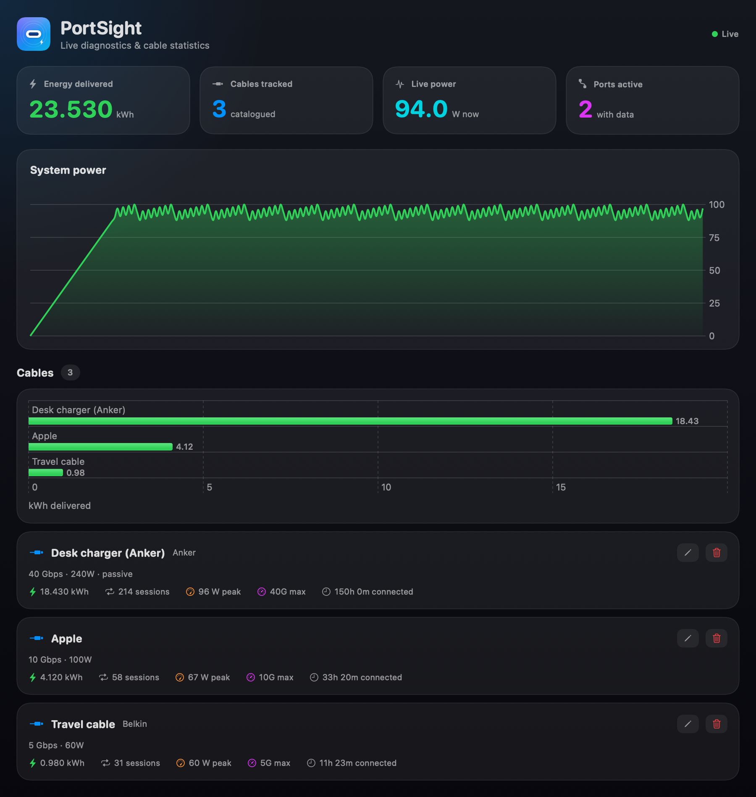
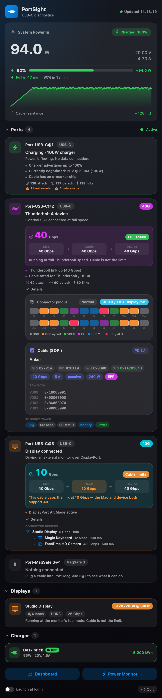

<p align="center">
  
</p>

<h1 align="center">PortSight</h1>

<p align="center"><b>Super-nerdy USB-C diagnostics for Apple Silicon Macs.</b></p>

PortSight lives in your menu bar and tells you what every USB-C cable and port
on your Mac is actually doing — negotiated speed, power delivery, health, and
more — plus a full dashboard window with live charts and **per-cable lifetime
statistics** (energy delivered, sessions, peak power, top speed).

Requires macOS 14+ on Apple Silicon.

## Screenshots

<p align="center">
  <br>
  <em>Dashboard — live power chart and per-cable energy statistics</em>
</p>

<p align="center">
  <br>
  <em>Menu bar — power, battery ETA, cable speed, port health</em>
</p>

## Features

**Live diagnostics (menu bar)**
- **Cable speed** — negotiated link speed with the Mac → cable → device chain and
  the limiting element highlighted
- **Power Delivery** — live wattage/voltage/current, PD contract inspector (all
  PDOs decoded, winning profile flagged)
- **Battery** — charge-time estimates (to 80%, to 100%) and remaining runtime
- **Displays** — active resolution/refresh, DisplayPort lanes and link rate
- **Port health** — lifetime attach/detach, link, overcurrent, hard-reset,
  short, I²C, role-swap and FET-failure counters
- **Liquid detection** — LDCM sensor status per port
- **Cable resistance** — milliohm estimate from a multi-point power regression
- **Nerd details** — Type-C pin diagram, raw Discover-Identity VDOs, and a
  decoded PD protocol event trace

**Dashboard window**
- Live system-power chart
- Global stats (total energy delivered, cables tracked)
- Per-cable statistics with energy bar chart, rename and history

**Command line (`portsight` / `cablepro`)**
```
cablepro                 human-readable snapshot
cablepro --json          machine-readable JSON
cablepro --raw           include raw register / VDO dumps
cablepro --watch         live refresh on hardware changes
cablepro --monitor       stream live power + battery + cable state
cablepro --dashboard     full-screen terminal dashboard
```

## Install (prebuilt)

1. Download `PortSight.zip` from the [latest release](https://github.com/Giorgiofox/portsight/releases/latest).
2. Unzip and move `PortSight.app` to `/Applications`.
3. The app is ad-hoc signed (no paid Developer ID), so macOS Gatekeeper
   quarantines it on first launch. Clear the quarantine flag once:
   ```sh
   xattr -dr com.apple.quarantine /Applications/PortSight.app
   ```
   (or right-click the app → **Open** → **Open** the first time)
4. Launch it — the PortSight icon appears in the menu bar (no Dock icon).

## Build from source

```sh
git clone git@github.com:Giorgiofox/portsight.git
cd portsight
swift build                 # builds cablepro (CLI) + CablePro (app)
./scripts/make-icon.sh      # generate the app icon
./scripts/bundle-app.sh     # → PortSight.app (menu-bar agent)
open PortSight.app
```

Requires the Swift toolchain (Command Line Tools are enough — no full Xcode).
Per-cable statistics persist to `~/Library/Application Support/PortSight/`.

## Notes

Cables are identified by their e-marker fingerprint (vendor/product + VDOs).
USB-PD has no per-unit serial, so identical cables of the same model share a
fingerprint. Cables without an e-marker chip (cheap ≤60W / USB 2.0) carry no
identity and cannot be catalogued.

## License

MIT. See `LICENSE` and `NOTICE.md`.
